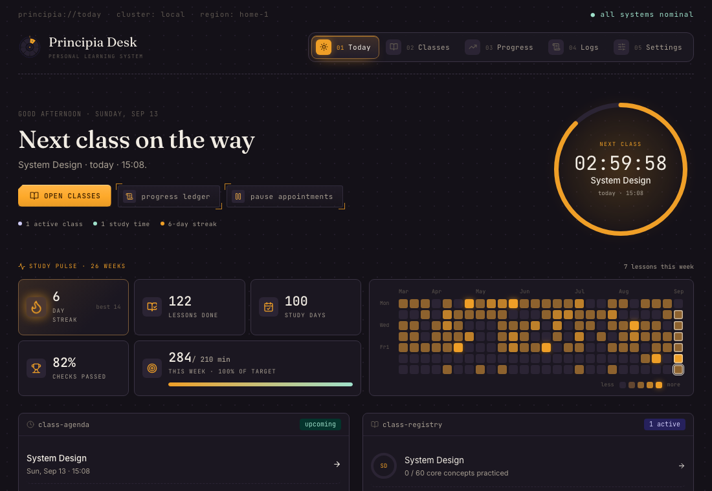
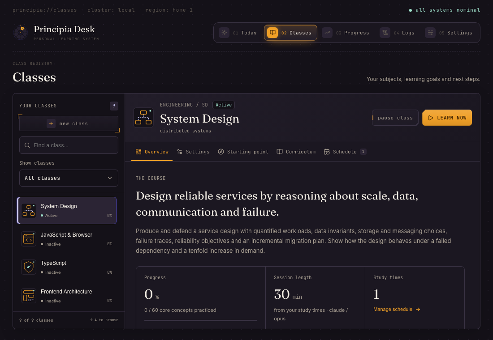
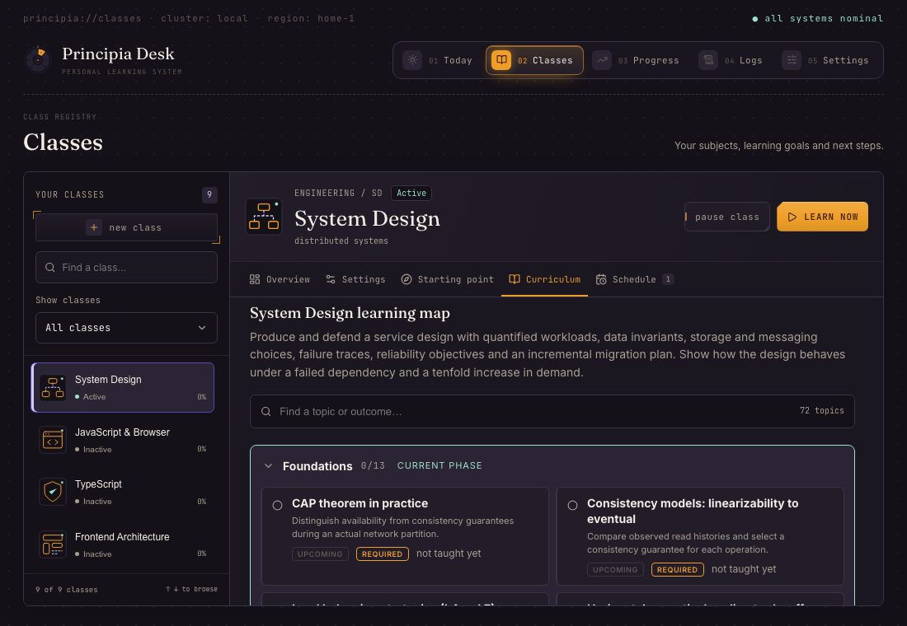
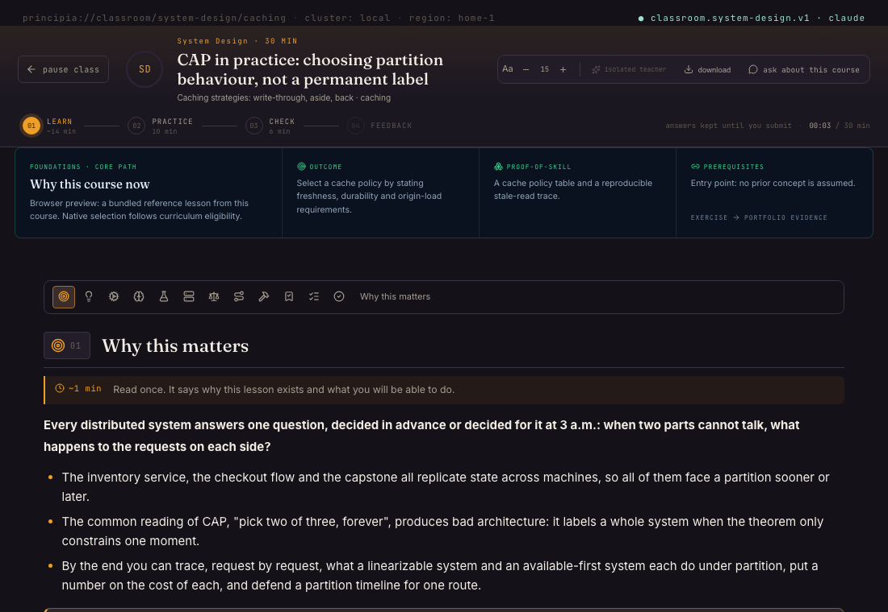
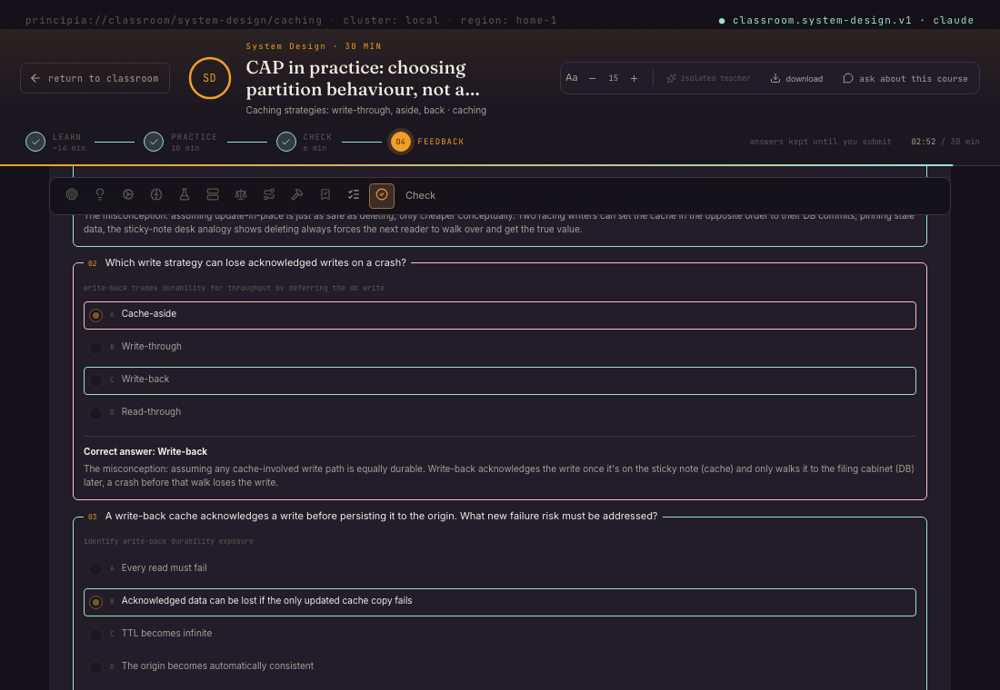
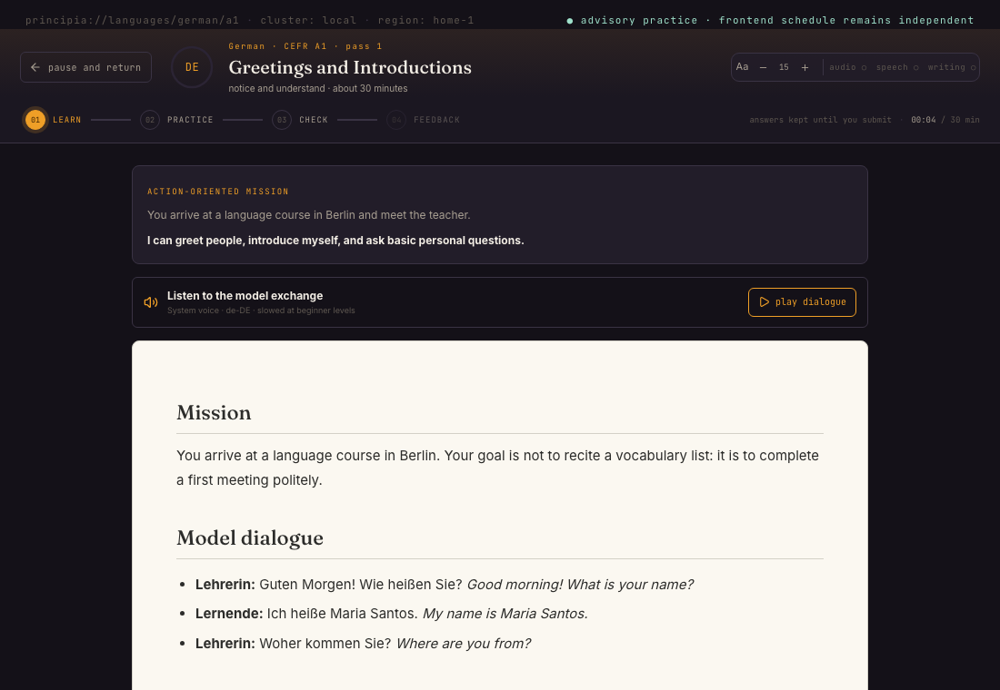
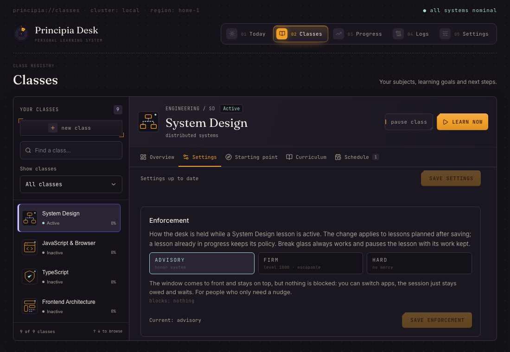

<p align="center">
  
</p>

# Principia Desk

[](https://principia.ndelucien.com) [](https://github.com/dark-matter08/principia-desk/releases/latest) [](https://github.com/dark-matter08/principia-desk/actions/workflows/ci.yml) [](LICENSE)

**Understand deeply. Practice daily.** A desktop study desk, for macOS, Windows and Linux, for learning subjects from their foundations: nine classes with personal starting points, lessons taught by your own AI tutor from verified primary sources, durable appointments, and enforcement you choose per class. The site is [principia.ndelucien.com](https://principia.ndelucien.com); the story of how it came to be is on [ndelucien.com](https://ndelucien.com).

Principia Desk keeps the visual character of its predecessor and its database, and replaces the once-a-day routine with classes you schedule, a shared study runtime that saves every step, and honest progress denominators.



## What a day looks like

**Today** combines your classes' appointments. Each class has recurring study times; every enabled time produces one durable appointment per day that is due at its time, missed once the day passes, and consumed exactly once by the session that serves it. Missed appointments can be made up or skipped. Topics whose spaced review is due appear with a Start review action.

**Classes** hold the nine subjects: Linux Bash, Bash Scripting, JavaScript & Browser, TypeScript, Frontend Architecture, Developer Tooling, System Design, German and Italian. Each class has its own tutor, study times, enforcement policy, accepted personal path and curriculum map.

### Study times set the pace

A study time is a rule: a start time, the weekdays it repeats on, and for each of those days its own length. Monday can be an hour and Wednesday ninety minutes on one rule; a different time on some days is simply another rule. The presets run 30 min, 1 h, 1 h 30, 2 h and 4 h, and any length from 10 minutes to 8 hours can be typed. Appointments take the day's length, the overlap check compares each rule at its time, and the launch agent wakes the desk for every rule's time.

Pace is not a setting. The class's session length follows the days its schedule is made of (the most common length, the shorter on a tie), so a lesson started by hand runs like the scheduled ones; the weekly commitment a language plan is measured against is what the study times add up to; and the week target on Today is the same sum. Enrollment asks for your goal, which the tutor reads before writing every lesson, and nothing about minutes.



## Starting points and personal paths

Every class starts where you already are. Choose the foundations, declare a starting stage with familiar topics, or take the placement check. The check samples every stage of the course, three skills each, and briefs you first: which stages it covers, what each one asks, how it places you and what skipping means. Lessons begin at the first stage you do not fully demonstrate, so no stage is skipped on a lucky answer and nothing is left unmeasured. The result is a path revision: an accepted entry point, the earlier material you can revisit, the refreshers upcoming work depends on, and the required outcome that remains. Declared familiarity and diagnostic samples never award completion, mastery or a streak.

Paths stay yours to revise. The Curriculum tab shows one status per topic against the accepted route (Completed here, Prior knowledge checked, Bypassed by choice, Needs refresher, Not assessed, Bridge lesson, In progress, Upcoming) with explicit denominators: required work on your route beside full-course core coverage. Check out of familiar topics, include them again, take a unit challenge to demonstrate a unit's entry samples, and accept or decline a bridge lesson when a failed check points at a prerequisite you set aside. Each decision is a new revision; history is never rewritten. When a course's curriculum changes, the class asks you to review its path before the next lesson.



## Your own classes

The nine courses are not the limit. **New class** on the Classes page opens the class builder, five steps on one rail:

1. **Brief.** A title, what you want to be able to do at the end, what you already know, documentation hosts you trust, and the tutor that will draft and teach it.
2. **Draft.** Ask the tutor, and it designs the whole course: four stages in the course's own words and 12 to 36 topics, each carrying what the bundled curricula carry (outcome, mechanisms, a production scenario, misconceptions, evidence, an artefact, two or more primary sources on the course's hosts). Or write it yourself from an empty course. Or import a `.principia-class.json` exported from any desk.
3. **Review.** An editor with the course header, the stages and a card per topic. The desk validates as you type and lists what it would refuse to publish: fewer than six topics, a stage without a core topic, a prerequisite in a later stage or in a circle, a source off the course's hosts, an outcome too vague to teach to.
4. **Verify.** Three checks in order, each unlocking the next: the tutor reads the draft back and returns findings with proposed fixes, fixed one at a time or all at once; the desk fetches every primary source and finds another for any that did not answer; you confirm your own read-through of the version as it stands.
5. **Publish.** Publishing registers the course, writes its topics into the curriculum under the class's id and opens the class. From then on it is any class: a starting point and study times set from its own tabs, lessons prepared ahead, blocks, retrieval on earlier topics, PDFs, enforcement, the custom badge the only difference.

The tutor can also **write the question bank**: three cited four-choice questions per stage on the course's core topics, held to the same shape as the bundled banks (the key among four distinct choices, a source on the course's hosts, every stage sampled three times). With it, the placement check and unit challenges work for the class; without it, the class offers the two starting points that need none. A learner who believes a written key is wrong disputes it from the check's result: the question stops counting, is left out of every sample, and is listed as disputed in the builder until the bank is written again. The bank itself is never shown before a check; for practice, every engineering class's Curriculum tab has a **Practice questions** strip where the tutor writes eight cited questions at a time for a chosen stage, answered at will with the key, the explanation and the source shown after each.

Before a class is published it passes three checks in order: the tutor reads the draft back and every finding is settled (fixed by the tutor, fixed by hand, or dismissed with a reason), every source is fetched and the unreachable ones replaced or kept knowingly, and you confirm your own read-through. A published class can be edited into a new version (lessons already taught keep their topics) and exported as one file, under `Documents/Principia Desk/classes/`, that carries the course and nothing personal. The design is in `docs/CUSTOM_CLASSES.md`.

## Lessons on one shared runtime

Engineering and language lessons run on one study runtime: planned on the accepted path, prepared under a lease by the class's tutor, published as an immutable lesson version with a frozen knowledge check, and finished in one transaction that records evidence, mastery and the appointment. Answers, production work, reading position and stage are saved as you go and restored after a restart. Failed preparation keeps the request for an explicit retry or discard.

The lesson shell is the same for every course: identity, stage rail (Learn · Practice · Check · Feedback), save state and time budget, reading size, and one return action. Engineering lessons add the purpose panel, reader, sources, exercise workspace, reflection and a tutor drawer; language lessons add the mission, model dialogue with system-voice playback, phrases, and writing and speaking practice before the check.





### Listening: the lesson as a conversation

A class can ask for its lessons as audio. Once a lesson is ready, the tutor writes it a second time as a conversation between a teacher and a sharp student, in a spoken register that follows the lesson's own sections (the check questions stay a check), and the desk voices every line with the engine and the two voices the class chose; the audio never delays the lesson, and a voice that fails leaves the transcript for the desk to read itself. The lesson's **listen** key opens a dock with play, pause, a line at a time, the speed, and the transcript with the spoken line lit; a lesson whose class has listening off can still be voiced from that dock, one at a time.

Settings › Voices sets the engines up and finds the ones already on the machine (a `piper` on the PATH, a Python that imports `kokoro` or `mlx_audio`, an activated virtual environment included): the **system voice** (nothing to install), **Piper** (a neural voice on any processor, the `piper-tts` package in an isolated Python under the profile, voices of about 60 MB downloaded one at a time), **Kokoro** (an 82M model, through mlx-audio on Apple Silicon and the `kokoro` package elsewhere) and **VibeVoice** (Microsoft's two-host model, the realtime 0.5B: through mlx-audio on Apple Silicon, through the official PyTorch package everywhere else, on an NVIDIA GPU when there is one and on the processor otherwise, where it renders slower than it plays and the desk absorbs that by writing ahead of the study time; named voices in English, German and Italian). Each class picks an engine and a voice per host in its Settings › Listening; the first render of Kokoro or VibeVoice fetches the model. `docs/TEACHER.md` §5a is where the idea came from.

### Retrieval, bridges and unit challenges

- **Delayed retrieval**: when a topic's mastery review is due, a retrieval session (recall, check, feedback, no new lesson) is prepared without a provider from the topic's bundled reference questions, preferring ones the last lesson did not show; repeated samples are labelled as such.
- **Bridge lessons**: a failed check on a topic whose prerequisite was set aside proposes a short bridge lesson; accepting it serves that topic next, once.
- **Unit challenges**: class-owned assessment attempts that sample a unit's entry questions; passing samples let you check out of exactly those topics, with no lesson, appointment or lock involved.

### German and Italian

Each language ships 40 scenario units across A1–B2 with seven passes per scenario, and each pass has its own task family: recognition, form and meaning, guided interaction, listening transfer, written production, spoken production and integrated retrieval. Curated checks rotate so consecutive passes share at most one item, and a pass counts only with the practice evidence its phase needs (the exchange played, twelve written words, the speaking task marked done). Practice evidence stays self-reported and is never presented as assessed proficiency; CEFR dates are planning targets, not certificates.



## Enforcement you choose per class

Each class carries a focus policy: **advisory** (the window comes to front, nothing is blocked), **focused** (full screen, always on top, focus snaps back every 300 ms, other displays sealed, media paused; switching away is useless but nothing at the system level is disabled) or **strict** (also blocks application switching, Force Quit, logout and shutdown while locked). The system-level part of strict is what the platform lets an application do: macOS lets the desk hide the Dock and disable Cmd+Tab, Force Quit, logout and shutdown; Windows and Linux do not hand that to an application, so there strict holds the desk the way focused does and the ways out below are the same. A native focus coordinator admits one focused or strict session at a time, engages the kiosk when it activates, releases it on completion, skip or the escape hatch, and re-engages after a restart. Starting another class while a focused session holds the desk is refused; the focused session cannot be paused from the lesson.



### Ways out of a locked session

Strict mode blocks application switching, Force Quit and logout where the platform allows it, so it must never be the only thing standing between you and your own machine. Five ways out, on every platform, in the order you would reach for them:

1. **Finish the check.**
2. **Break glass.** A dim link reveals a long phrase rendered as non-copyable SVG (paste disabled). Typing it pauses the focused class lesson with its work kept and releases the lock; three wrong attempts lock the input for 60 seconds.
3. **The recovery console.** Press **Control + Option + Shift + U** (Ctrl + Alt + Shift + U on Linux and Windows). A small console opens above every window, a locked desk included; the combination is registered with the system, not the page, so a blank or frozen desk cannot swallow it. Four commands, typed in order, end the session:

   | # | Type | What happens |
   |---|------|--------------|
   | 1 | `unlock` | Reports the desk's state, says what releasing will do and issues a six-character challenge code (valid for five minutes). |
   | 2 | `confirm <code>` | Type the code back. It proves a person is at the keyboard; a wrong code keeps the challenge, an expired one starts over. |
   | 3 | `phrase <your escape phrase>` | The break-glass phrase from setup, exactly as written. Three wrong attempts lock this step for 60 seconds. |
   | 4 | `release` | Pauses the session with its work intact, breaks the streak, drops the lock and closes the console. |

   `status` shows where you are in the sequence, `cancel` starts it over, `close` (or Esc) leaves the console with the desk untouched. Nothing changes until the fourth command. If the console itself cannot appear, **press the combination five times within ten seconds** and the lock releases on its own. The same steps are shown in Settings › Recovery, with a walkthrough you can replay.

   The combination is one registration, named per platform by the desk itself: macOS calls it Control + Option + Shift + U (a system hot key, no permission needed, works over full-screen apps and on every Space); Windows and Linux call it Ctrl + Alt + Shift + U. On Windows another program already holding the combination makes registration fail; on Linux it needs X11, since Wayland desktops do not hand global shortcuts to applications. Settings › Recovery shows whether the system took it; when it did not, the release token and the escape hatch still stand.
4. **A release token.** Create a file or folder named `principia-unlock` in any of these places and the lock releases within a second:
   - your home directory (`touch ~/principia-unlock`),
   - the temporary directory (`/tmp` on macOS and Linux, `%TEMP%` on Windows),
   - **the root of any mounted volume**: a USB stick, an external disk, a mounted share (`/Volumes` on macOS; `/media`, `/run/media` and `/mnt` on Linux; every drive letter from D: on Windows).

   The volume rule is the one that needs no terminal and no second machine: prepare a stick once, keep it near the desk, and plug it in. While a token exists the kiosk also refuses to engage at all, so a machine that boots with the stick in stays free. Delete the token to re-arm.
5. **The dead man's switch.** A lock releases itself after three hours regardless of what the app believes. No lesson runs that long; a lock still standing is a stuck process, and it lets go.

A force shutdown alone does not end a session: an active focused session reopens at its saved position on the next launch. Boot with the release token in place instead.

### Recovery (if a broken build ever locks you out)

The kiosk refuses to engage until the webview reports ready (white-screen guard), so a dead frontend cannot hold a lock. If you are ever stuck anyway:

1. **Open the recovery console** with Control + Option + Shift + U and walk the four steps above; or press the combination five times in ten seconds if no console appears.
2. **Plug in the release stick** described above, or create the token and stop the desk's own scheduler from another machine or another session:
   ```bash
   # macOS: the launch agent
   touch ~/principia-unlock
   launchctl bootout gui/$(id -u) ~/Library/LaunchAgents/com.darkmatter.principia-desk.plist
   rm -f ~/Library/LaunchAgents/com.darkmatter.principia-desk.plist
   # Linux: the systemd user timer
   touch ~/principia-unlock
   systemctl --user disable --now principia-desk.timer
   ```
   ```powershell
   # Windows: the Task Scheduler entry
   New-Item -ItemType File "$HOME\principia-unlock"
   schtasks /Delete /TN "Principia Desk" /F
   ```
3. **A session that starts nothing.** macOS Safe Mode (Apple Silicon: hold power → pick disk → hold Shift) loads no third-party launch agents; Windows Safe Mode runs no scheduled tasks; a Linux console session (Ctrl+Alt+F3) has no desktop for the window to hold. Run the commands above there, reboot.
4. **From outside the system.** macOS Recovery Mode Terminal: `rm "/Volumes/Macintosh HD/Users/<you>/Library/LaunchAgents/com.darkmatter.principia-desk.plist"` and `touch "/Volumes/Macintosh HD/Users/<you>/principia-unlock"`; a live USB on Linux or Windows: the same token file in the home folder of the mounted disk. Then reboot.

Nothing here depends on the main window being healthy: the console is its own window on a system-wide shortcut, the token is checked by the same loop that holds focus, and the dead man's switch fires without any input at all.

## Content generation: your provider

Settings separates **Runners & models** from the **Active tutor**. Three runner routes are supported:

- **An agent I already have:** Claude Code, Codex, Cursor Agent, Gemini CLI or a custom command. Each CLI keeps its existing authentication.
- **My own API key:** Anthropic, OpenAI, Google Gemini, OpenRouter, Groq, Mistral or DeepSeek. Keys are shared by the desk and its classes and saved from Settings into the platform's own secret store: the Keychain on macOS, the Credential Manager on Windows, the desktop's secret service (GNOME Keyring, KWallet) on Linux. Environment keys take priority.
- **On this machine:** Ollama installation, detection and start, installed models, a model shelf with approximate download and RAM sizes, background downloads, testing and removal. Local models answer locally; the teaching backend still fetches source documentation from the web.

Each class keeps its own tutor choice and prompt contract. Every request carries the desk's writing rules and every answer is read for the tells of machine writing (the signs Wikipedia's editors document: stock vocabulary, empty constructions, chat openers, em dashes) and sent back when it fails them; see [docs/WRITING_RULES.md](docs/WRITING_RULES.md). Lesson generation uses exactly the configured provider and model and must pass the full course, five-check, exercise, source and first-principles quality gate; a missed gate gets one same-provider correction pass and a same-provider senior-editor review, otherwise the real error is shown. Bundled reference lessons exist for every engineering course in five roles (beginner, advanced, remediation, retrieval, capstone); they feed retrieval sessions and offline checks and are never substituted for a generated lesson. See [the runner implementation record](docs/AGENT_BACKEND_PORT.md).

## Sourcing: what lessons are taught from

Lessons are taught from documentation the app fetches itself. Before each generation, Rust retrieves up to five primary documents from an allowlist of publishers (MDN, web.dev, the WHATWG and W3C specifications, TC39, Chrome/V8/WebKit developer docs, Node, TypeScript, the major framework docs, RFCs, and GNU/Linux manuals for the Bash courses), extracts the readable prose, and hands it to the tutor as quoted material it must cite inline. A lesson must link at least three retrieved documents on the claims they support; every URL in the reading list is verified over the network and unreachable ones are removed. If retrieval fails entirely, the lesson still runs without unverified links and the generation log says why.

Every concept carries a specific curriculum brief: learner outcome, named mechanisms, production scenario, misconceptions, observable evidence, cumulative artifact and in-policy primary sources, validated offline.

A tutor that cannot browse (Ollama, OpenRouter, any bare API) can be given a search engine in Settings › Web search: **SearXNG** on this machine, no key; the Brave Search API; or Tavily. The desk searches for itself, restricted to the subject's allowed hosts, fetches what it finds and hands the tutor only pages it retrieved. For SearXNG the desk does the running too: it finds an instance already answering (Remote Ledger's, on the same port, is shared rather than duplicated), starts one that is installed but stopped, or installs its own under `~/.principia-desk/searxng` from the setup page, a shallow clone and an isolated Python, with the JSON API turned on, every step reported on the Logs page.

## Always on: the menu bar desk and the study alarm

The desk stays resident. Closing the window or pressing Cmd+Q (Alt+F4 elsewhere) hides it behind a menu bar icon (the system tray on Windows and Linux); the scheduler starts it at login and at every study time, and Quit lives in the icon's menu. That menu says what is due, what comes next and when, and lists today's appointments with their state. On macOS the panel is a native, non-activating panel that opens over full-screen apps; on Windows and Linux it is a small window at the icon.

When an appointment comes due the desk sends a system notification and starts an alarm that repeats until the lesson starts. The menu bar shows the class as due, Today shows the same banner, and both offer exactly two things: **Start**, and a **snooze** of 5, 10 or 15 minutes that rings again when it passes. There is no dismiss. The break-glass phrase lives inside the started lesson, so the way out of a session still exists, but only after it has begun. Quit is withheld while an alarm rings or a focused session holds the desk.

Two things outrank the alarm, because nothing here may hold a machine hostage: pausing appointments, which owes nothing and so rings for nothing, and the release token described above, which silences it along with every lock. `--debug-day` builds never ring unless `PRINCIPIA_ALARM_IN_DEBUG` is set, so QA profiles stay quiet.

## Scheduling

The desk registers itself with the platform's own scheduler and fires at every enabled study time: a launchd LaunchAgent on macOS (`~/Library/LaunchAgents/com.darkmatter.principia-desk.plist`, one `StartCalendarInterval` array), a systemd user timer on Linux (`~/.config/systemd/user/principia-desk.{service,timer}`), a Task Scheduler entry on Windows (`schtasks`, task name `Principia Desk`). The entry is checked on every launch and reinstalled when it is missing or names another executable.

- A time missed while **asleep** fires on wake; missed while **powered off** fires at next login, and the app materializes the day's appointments on every launch and every 60 s.
- Already running: an in-app watcher marks appointments due at the scheduled minute; focused and strict classes engage the kiosk when their session activates.
- Changing any study time rewrites and reloads the interval set; overlapping times across active classes are refused with the conflict named.

## Install

### Prerequisites

- macOS 13+, Windows 10+ (the installer brings WebView2 if it is missing), or a Linux desktop with WebKitGTK 4.1 (Ubuntu 22.04+, Fedora 36+, Debian 12+ and their relatives).
- A supported CLI, a provider API key, or Ollama with a downloaded chat model.
- To build: Rust 1.80+, Node 20+; on Linux also `libwebkit2gtk-4.1-dev`, `libappindicator3-dev`, `librsvg2-dev`, `patchelf` and `libgtk-3-dev`.

For an installed app, choose **My own API key** in Settings and save a key for the provider you want. Keys live in the platform's secret store under the `principia-desk` service with separate `<provider>_api_key` accounts (the Keychain on macOS, the Credential Manager on Windows, the Secret Service on Linux); a key saved under the previous service name is still read, so an upgrade never looks like a lost key. A machine with no secret store answering, or a headless one, takes `ANTHROPIC_API_KEY`, `OPENAI_API_KEY`, `GOOGLE_API_KEY` (or `GEMINI_API_KEY`), `OPENROUTER_API_KEY`, `GROQ_API_KEY`, `MISTRAL_API_KEY` or `DEEPSEEK_API_KEY` from the environment instead, and those win over a stored key everywhere.

### Build from source

```bash
git clone https://github.com/dark-matter08/principia-desk.git
cd principia-desk
npm install
npm run tauri dev           # against a dev server, hot reload
npm run tauri build         # the installers for this machine, under src-tauri/target/release/bundle/
```

`--bundles app` on macOS builds only the `.app` (`cp -R "src-tauri/target/release/bundle/macos/Principia Desk.app" /Applications/`); `--bundles msi,nsis` on Windows and `--bundles deb,rpm,appimage` on Linux pick the packages. Launch it, complete the setup (escape phrase and tutor check), add a class with a starting point and a study time, and it is armed.

> **Heads-up:** the builds are unsigned for the operating system. On macOS the first launch is right-click → Open, or `xattr -dr com.apple.quarantine "/Applications/Principia Desk.app"`; on Windows, SmartScreen asks for **More info → Run anyway**; on Linux, `chmod +x` the AppImage. `sudo apt install ./principia-desk_<v>_amd64.deb` from your Downloads folder may end with a notice that the file "couldn't be accessed by user '_apt'": that is apt's sandbox talking about the download step it did not need, and the lines above it (`Setting up principia-desk`) are the install succeeding.

### Releases

Every [release](https://github.com/dark-matter08/principia-desk/releases) carries installers for each platform, built by `.github/workflows/release.yml` when a version tag is pushed: Apple Silicon and Intel disk images, a Windows MSI and NSIS installer, and a Linux `.deb`, `.rpm` and AppImage. They are unsigned (see the heads-up above). To cut one, set the version everywhere it is written, note it in the changelog, tag and push:

```bash
npm run version:set -- 0.2.0
git commit -am "chore: release 0.2.0"
git tag v0.2.0 && git push origin main v0.2.0
```

The workflow verifies the tree first, refuses a tag that does not match the versions in `package.json`, `tauri.conf.json` and `Cargo.toml`, and attaches the installers to the release for the tag, creating it if the tag has none (creating the release in the GitHub interface pushes the tag and starts the same run). The release notes are the changelog's section for the version (`scripts/release-notes.mjs`). A shelved copy of the branch-binaries workflow sits in `.github/workflows-shelved/` for trying installers from a branch before anything is tagged.

### Updates from inside the desk

An installed desk (0.2.1 and later) reads the release's `latest.json` after it starts and every six hours, shows a newer version in Settings › Updates with the changelog notes, and installs it only when asked: the app bundle is replaced on macOS, the installer runs on Windows, the AppImage is swapped in place on Linux, and a `.deb` or `.rpm` goes through the package manager with a graphical password prompt. The desk relaunches after; the profile and its history stay where they are. This is not a publisher signature (the installers stay unsigned for the operating system): every installer gets a `.sig` from an Ed25519 key the pipeline holds as the `TAURI_SIGNING_PRIVATE_KEY` secret, `tauri.conf.json` carries the public half, and a download whose `.sig` does not verify is refused before anything runs, so a tampered file cannot ride in on an update. The last job of the release workflow writes the manifest from the assets the release actually carries. `PRINCIPIA_NO_UPDATE_CHECK=1` keeps a desk from checking, for a managed machine.

### Upgrading from System Design Roulette

The product carried its old identifiers for a while so a rename could not strand anyone's history. They have now moved with the name, and the first launch under the new identity brings the old profile across rather than starting you empty:

- The bundle identifier is `com.darkmatter.principia-desk` and the database is `principia.db`. If this build finds no profile of its own, it takes a consolidated copy of the one written under the old identifier, including anything still in its write-ahead log, and leaves the original untouched.
- The secret store service is `principia-desk`. Reads fall back to the old service, so saved provider keys keep working.
- The scheduler entry is `com.darkmatter.principia-desk` (the launch agent), `principia-desk` (the systemd timer) or `Principia Desk` (the scheduled task). The one installed under the old identity is unloaded and deleted on first launch, so a machine never carries two.
- The release token is `principia-unlock`, and a stick prepared with the old `sdr-unlock` name still frees a locked desk.

Numbered migrations still run after a pre-upgrade backup, and finished daily-routine sessions still import into the shared runtime once. See [docs/STORAGE.md](docs/STORAGE.md).

## Architecture

```
┌──────────────────── Svelte 5 webview (renderer) ──────────────────────────┐
│  Today · Classes (overview, settings, starting point, curriculum, schedule)│
│  LessonShell (engineering and language activities) · Progress · Settings  │
└────────────────────────────────────┬──────────────────────────────────────┘
                          invoke / events (typed IPC)
┌────────────────────────────────────┴──────────────────────────────────────┐
│  Rust core (all authority lives here)                                      │
│  domain/sessions.rs     shared study runtime: lifecycle, leases, versions, │
│                         checkpoints, results                               │
│  domain/assessments.rs  frozen rounds, revisioned answers, submissions     │
│  domain/classes.rs      accepted paths, revisions, bridges, selection      │
│  domain/placement.rs    entry banks, diagnostics, recommendations          │
│  domain/challenges.rs   unit challenges                                    │
│  domain/schedule.rs     durable appointments                               │
│  subjects/              engineering and language adapters                  │
│  enforcement.rs         focus coordinator; kiosk.rs the lock, per platform │
│  storage/               numbered migrations, backups, legacy import        │
│  generator.rs           strict lesson generation and bundled references    │
│  audio.rs · searxng.rs  listening mode (four engines); the local search    │
│  updater.rs · keychain  updates from inside the desk; keys per platform    │
└────────────────────────────────────────────────────────────────────────────┘
```

Design principle: **Rust owns all authority.** Lifecycles, locks, grading and selection live in the backend; the webview renders and requests transitions, which Rust validates. Data lives in the app's data directory (`~/Library/Application Support/com.darkmatter.principia-desk/` on macOS, `%APPDATA%\com.darkmatter.principia-desk\` on Windows, `~/.local/share/com.darkmatter.principia-desk/` on Linux) as a SQLite database with WAL journaling and pre-upgrade backups. Contracts are described in [docs/SHARED_SESSION_RUNTIME.md](docs/SHARED_SESSION_RUNTIME.md) and [docs/STORAGE.md](docs/STORAGE.md); the design system in [DESIGN.md](DESIGN.md).

## Documentation

| Where | What |
|---|---|
| [CHANGELOG.md](CHANGELOG.md) | What changed, release by release |
| [CONTRIBUTING.md](CONTRIBUTING.md) | How to set up, the gates, how a change is made |
| [SECURITY.md](SECURITY.md) | What counts as a security report and where a key may go |
| [CODE_OF_CONDUCT.md](CODE_OF_CONDUCT.md) | How we treat each other |
| [DESIGN.md](DESIGN.md) | The design system: tokens, components, vocabulary |
| [docs/STORAGE.md](docs/STORAGE.md) | The database, migrations and enrollment contracts |
| [docs/SHARED_SESSION_RUNTIME.md](docs/SHARED_SESSION_RUNTIME.md) | Sessions, stages, preparation and grading |
| [docs/CUSTOM_CLASSES.md](docs/CUSTOM_CLASSES.md) | Your own classes: the process and what is underneath |
| [docs/WRITING_RULES.md](docs/WRITING_RULES.md) | The writing rules every generated text is held to |
| [docs/TEACHER.md](docs/TEACHER.md) | The teacher agent and the mastery ledger |
| [docs/CATALOG.md](docs/CATALOG.md) | The course catalogue and how a course is authored |
| [docs/PRODUCT_EVOLUTION_PLAN.md](docs/PRODUCT_EVOLUTION_PLAN.md) | The plan and its record, increment by increment |
| [landing/](landing/README.md) | The site, principia.ndelucien.com, and how it deploys |

## Development

```bash
npm run tauri dev          # full app against a dev server
npm run dev                # frontend only, in a browser, with mock data
npm run check              # catalogue check + svelte-check
npm test                   # frontend tests
cd src-tauri && cargo test # Rust integration tests
```

Useful flags and env vars:

| Flag / env | Effect |
|---|---|
| `--debug-day` | No OS lock (the focus coordinator only records the lock), schedule ignored |
| `--triggered` | What the scheduler passes; goes straight to the appointment check |
| `PRINCIPIA_DATE=2026-06-12` | Override "today" for multi-day flows |
| `PRINCIPIA_NO_UPDATE_CHECK=1` | Never read the release manifest (a managed machine) |
| `PRINCIPIA_PIPER_VOICES=/dir` | One more folder of Piper voices to find |
| `PRINCIPIA_PYTHON_DIRS=/a:/b` | More folders to look for a Python in, for SearXNG and the voices |
| `PRINCIPIA_CLAUDE_BIN=/path` | Override the Claude binary (`/usr/bin/false` makes preparation fail deliberately) |
| `PRINCIPIA_CODEX_BIN=none` | Disable the Codex runner |
| `DEEPSEEK_API_KEY=...` | Authenticate DeepSeek for the whole process |
| `OLLAMA_URL=http://127.0.0.1:11434` | Optional loopback Ollama endpoint; remote endpoints are rejected for the local route |
| `touch ~/principia-unlock` | Instantly release the kiosk lock |

The `study_fixture` example publishes a bundled reference lesson into a class's planned session without a provider (`cargo run --example study_fixture -- <db> <subject> [--fail|--skip]`), which is how the desktop checks in `docs/DESKTOP_ASSESSMENT_QA.md` were run against an isolated profile. Demo mode in a plain browser serves canned data from `src/lib/mock.ts` with the same contracts as the native commands.

## The Teacher

The generation layer is a persistent teaching agent; see [docs/TEACHER.md](docs/TEACHER.md). A per-concept mastery ledger is compiled into a dossier so each lesson builds on prior work and attacks recorded misconceptions. The engineering catalogue spans 300 concepts across seven courses with a visible foundations → mechanisms → production → synthesis path before electives; each course has a curriculum map, entry map, diagnostic bank and reference lessons. Progress separates curriculum coverage, demonstrated competency, practice evidence and review due, each with its own denominator.

## Roadmap

- [ ] Windows and Linux: the study times, the alarm and the tray are built for them and not yet walked through on real machines
- [ ] Strict enforcement's system-level blocks on Windows and Linux (macOS has them; the platforms do not hand them to an application yet)
- [ ] Rescheduling a single appointment
- [ ] Notarized builds and signed installers (the updater's own signature exists; the operating systems' do not)
- [ ] VibeVoice's long-form 1.5B model (the desk runs the realtime 0.5B everywhere; the 1.5B wants a GPU and is not converted for mlx yet)

## License

[MIT](LICENSE)
